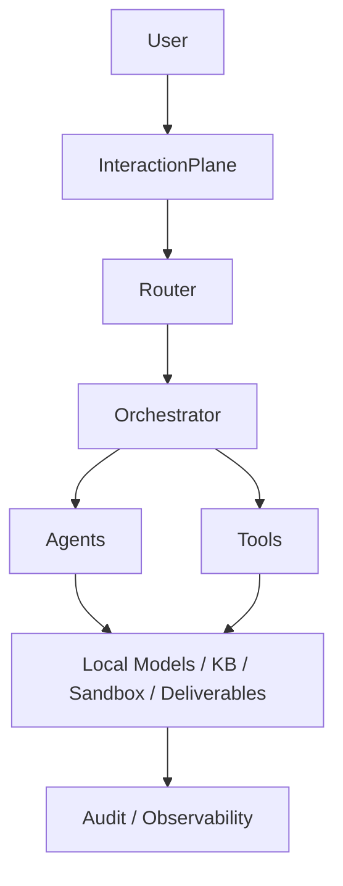

# SETU — AI ONBOARDING & LIVE PROJECT STATE

> [!IMPORTANT]
> ## AI BOOT PROTOCOL
>
> Before modifying ANY code:
>
> 1. Read `AI_onboarding.md`
> 2. Read applicable repository AI instructions (e.g. `AGENTS.md`)
> 3. Check `git status`
> 4. Inspect the relevant files
> 5. Check ownership and active work
> 6. Check contract locks and known blockers
>
> After meaningful work:
>
> 7. Run appropriate tests
> 8. Update `AI_onboarding.md`
> 9. Verify that the document matches the actual repository
> 10. Review the final diff
>
> Never guess project state.
> Never silently change shared contracts.
> Never overwrite another owner's area without coordination.
> Never claim completion without evidence.

## SECTION 1 — PROJECT IDENTITY

- Project name: SETU
- Hackathon context: Smart Automation
- Problem Statement ID if known: 26117
- Problem Statement title if known: Sovereign On-Premise Agentic AI Workbench using Open-Weight Multimodal LLMs for Confidential Industrial Work
- Organization if known: Mangalore Refinery and Petrochemicals Limited (MRPL)
- One-sentence description: A sovereign AI system orchestrating multiple local models and agents for confidential industrial work.
- Core goal: To build a local, multi-model AI system with orchestration, specific typed tools, and strict security boundaries.
- Current phase: Core Integration Scaffold Complete (Backend & Frontend)
- Last updated timestamp: 2026-09-06 (Branch: p6-deliverables)
- Last updated by: Antigravity / Mudit Ranjan (P6)

## SECTION 2 — WHAT SETU IS

SETU is a sovereign/self-hosting intended solution utilizing a local/open-weight model architecture. It uses a multi-model approach with the following architectural distinctions:
- **Router** chooses the entry model.
- **Orchestrator** decides what happens next (sequencing).
- **Agents** specialize (Vision, Reasoning, Coding, etc.).
- **Tools** perform typed actions (narrow capability surface).

It includes a multimodal capability, a local knowledge base, deliverable generation, and strict security boundaries (restricted filesystem access, sandbox execution). It is NOT a generic chatbot.

## SECTION 3 — ARCHITECTURE SNAPSHOT

The integration scaffold is implemented. All endpoints and SSE flow end-to-end, but most agent logic is MOCKED or SCAFFOLDED.

- frontend: IMPLEMENTED (UI rendering, SSE streaming, Audit view)
- backend: IMPLEMENTED (FastAPI, events, dispatcher, state)
- Ollama: IMPLEMENTED (Client written, untested live)
- router: IMPLEMENTED (Rule-based)
- orchestrator: IMPLEMENTED (Executor, gates, policy)
- agents: SCAFFOLDED (Stubs exist, mocked adapters active)
- tools: MIXED (FS, Docgen, Audit real; KB, Sandbox, OCR scaffolded/mocked)
- audit: IMPLEMENTED (Hash-chained)
- network/security: IMPLEMENTED (CORS, path jail, netwatch)

## SECTION 4 — TEAM / ROLE OWNERSHIP

| Role | Owner | Responsibility | Main Files/Dirs | Current State |
|------|-------|----------------|-----------------|---------------|
| P1 — Orchestrator / Router | UNKNOWN | Core flow | `backend/app/main.py` etc. | IN_PROGRESS (Scaffold done) |
| P2 — Vision / OCR Agent | UNKNOWN | Vision capabilities | `backend/app/agents/vision.py` | NOT_STARTED (Scaffolded) |
| P3 — Reasoning / KB | UNKNOWN | Reasoning & KB | `backend/app/agents/reasoning.py` | NOT_STARTED (Scaffolded) |
| P4 — Coding / Sandbox | UNKNOWN | Code exec & isolation | `backend/app/agents/coding.py` | IN_PROGRESS |
| P5 — Frontend / Observability | UNKNOWN | UI & Monitoring | `frontend/` | IMPLEMENTED |
| P6 — Deliverables / Audit | Mudit Ranjan | Audit & outputs | `backend/app/security/audit.py` | IN_PROGRESS |

## SECTION 5 — FILE / DIRECTORY OWNERSHIP

Ownership map:
- `backend/app/main.py` → P1
- `backend/app/config.py` → P1
- `backend/app/contracts.py` → P1 / SHARED
- `backend/app/router.py` → P1
- `backend/app/orchestrator/` → P1
- `backend/app/llm/` → P1
- `backend/app/agents/vision.py` → P2
- `backend/app/agents/reasoning.py` → P3
- `backend/app/agents/coding.py` → P4
- `backend/app/tools/docgen.py` → P6
- `backend/app/tools/sheets.py` → P6
- `backend/app/tools/kb.py` → P3
- `backend/app/tools/ocr.py` → P2
- `backend/app/tools/fs.py` → P4
- `backend/app/tools/sandbox.py` → P4
- `backend/app/tools/registry.py` → P1
- `backend/app/security/audit.py` → P6
- `backend/app/security/integrity.py` → P6
- `backend/app/security/injection.py` → P3
- `frontend/` → P5
- `templates/` → P6
- `data/demo_assets/` → P6
- `scripts/verify_audit.py` → P6

## SECTION 6 — CURRENT IMPLEMENTATION STATUS

*As verified against `docs/STATUS.md` on 2026-09-05*

| Component | Owner | Status | Evidence | Dependencies | Next Action |
|-----------|-------|--------|----------|--------------|-------------|
| contracts | P1 | REAL | `backend/app/contracts.py` | None | Maintain |
| main API | P1 | REAL | `backend/app/main.py` | contracts | None |
| router | P1 | REAL | `backend/app/router.py` | API | None |
| orchestrator | P1 | REAL | `backend/app/orchestrator/` | Router | Wire actual LLM calls |
| Ollama client | P1 | REAL (Untested) | `backend/app/llm/ollama_client.py` | - | Test against live Ollama |
| model registry | P1 | REAL | `config/models.yaml` | Ollama client | - |
| vision agent | P2 | SCAFFOLDED | `backend/app/agents/vision.py` | orchestrator | Implement logic |
| OCR cascade | P2 | SCAFFOLDED | `backend/app/tools/ocr.py` | vision agent | Implement extractors |
| reasoning agent | P3 | SCAFFOLDED | `backend/app/agents/reasoning.py` | orchestrator | Implement logic |
| coding agent | P4 | SCAFFOLDED | `backend/app/agents/coding.py` | orchestrator | Implement logic |
| knowledge base | P3 | SCAFFOLDED | `backend/app/tools/kb.py` | - | Implement ingest |
| injection defence | P3 | REAL | `backend/app/security/injection.py` | main API | Full defence check |
| sandbox | P4 | REAL (Unverified) | `backend/app/tools/sandbox.py` | - | Execute against Docker |
| filesystem jail | P4 | REAL | `backend/app/security/paths.py` | - | - |
| sheet_op | P6 | IMPLEMENTED | `backend/app/tools/sheets.py` | - | Done (describe, read, compute, write complete) |
| docgen | P6 | IMPLEMENTED | `backend/app/tools/docgen.py` | - | Done (docx and pptx complete) |
| audit | P6 | IMPLEMENTED | `backend/app/security/audit.py` | - | Done (hash-chained log verified) |
| integrity | P6 | IMPLEMENTED | `backend/app/security/integrity.py` | - | Done (model verification digests implemented) |
| frontend | P5 | REAL | `frontend/dist` | main API | Visual polish |
| SSE / Events | P1/P5 | REAL | `backend/app/orchestration/events.py`| API | Emit tokens |
| network monitor | P4 | REAL | `backend/app/security/netwatch.py` | - | - |
| demo assets | P6 | IMPLEMENTED | `data/demo_assets/` & `templates/` | - | Done |
| tests | All | REAL | `pytest backend/tests` | all | See Verification Matrix |

## SECTION 7 — CONTRACT LOCKS

- `backend/app/contracts.py`: Contains 30+ validated models. Do not casually change.
- Seven-tool capability surface schemas (`kb_search`, `read_file`, `write_file`, `list_dir`, `run_python`, `sheet_op`, `docgen`)
- SSE event types (`route`, `plan`, `step_start`, `token`, `step_done`, `attempt`, `escalate`, `artifact`, `audit`, `error`)
- Mock adapters located in `backend/app/mocks/adapters.py`

## SECTION 8 — ARCHITECTURAL DECISIONS

### ADR-001 — Master Blueprint Constraints
Status: Accepted
Decision: Enforce sovereign, local-model architecture.
Consequences: Must use Ollama, strict filesystem jail, Docker sandbox, and no shell tools.

### ADR-002 — Three-Layer Architecture
Status: Accepted
Decision: Use Directives (Layer 1), Orchestration (Layer 2), and Deterministic Execution (Layer 3).

## SECTION 9 — ACTIVE WORK

| Owner | Task | Files | Status | Started | Dependency | Notes |
|-------|------|-------|--------|---------|------------|-------|
| Antigravity | Sync repository state | `AI_onboarding.md` | IMPLEMENTED | 2026-09-06 | None | Synced P6 deliverables |
| Mudit Ranjan (P6) | P6 Deliverables | `backend/`, `data/`, `templates/` | COMPLETED | - | - | Committed in 05a6b76 |
| Mudit Ranjan (P6) | Integration & Demo Validation | P6 integration | IN_PROGRESS | - | Other teams | Validate demo flow |

## SECTION 10 — BLOCKERS

None active. Initial scaffolding and git import successful.
*Pre-hackathon (T-3) tasks require physical validation (Ollama, Firewall, Sandbox).*

## SECTION 11 — KNOWN BUGS / TECHNICAL DEBT

- `backend/tests/test_jail.py::test_resolved_symlink_escape_is_blocked` skipped (requires elevated shell on Windows to test).

## SECTION 12 — TEST / VERIFICATION MATRIX

| Area | Test / Check | Command | Result | Last Verified | Notes |
|------|--------------|---------|--------|---------------|-------|
| Backend | `pytest` | `pytest backend/tests -q` | 212 pass, 1 skip, 1 fail | 2026-09-06 | `p6-deliverables` branch result: 1 fail (P1 SSE bug). Note: The P1 SSE bug is VERIFIED FIXED on `origin/master` (9154aab) but P6 branch has not yet absorbed the fix. P6 tests 17/17 pass. |
| Frontend| `npm run build` | `tsc -b && vite build` | PASS | 2026-09-05 | 163kB JS |
| Audit | `verify_audit.py` | `python scripts/verify_audit.py` | PASS | 2026-09-05 | Chain intact |
| Health | `/api/health` | curl | PASS | 2026-09-05 | JSON returned |
| Frontend| `/` serve | curl | PASS | 2026-09-05 | `index.html` served |
| E2E | Flagship to DOCX | HTTP request | PASS | 2026-09-05 | Valid OOXML generated |

## SECTION 13 — DEMO CRITICAL PATH

| Demo Beat | Status | Owner | Expected Result | Fallback |
|-----------|--------|-------|-----------------|----------|
| 1. startup/preflight | REAL | P1 | App boots | - |
| 2. file upload | REAL | P5 | File received | - |
| 3. router decision | REAL | P1 | Route chosen | - |
| 4. plan proposal | REAL | P1 | Plan generated | - |
| 5. human approval | REAL | P5 | Plan approved | - |
| 6. vision extraction | SCAFFOLD | P2 | OCR complete | - |
| 7. KB search | SCAFFOLD | P3 | Context retrieved | - |
| 8. reasoning | SCAFFOLD | P3 | Conclusion reached | - |
| 9. approval note generation | REAL | P6 | Notes created | - |
| 10. spreadsheet describe | REAL | P6 | Sheet read | - |
| 11. spreadsheet read | REAL | P6 | Data parsed | - |
| 12. spreadsheet compute | SCAFFOLD | P6 | Compute finished | - |
| 13. spreadsheet write | REAL | P6 | File written | - |
| 14. coding agent | SCAFFOLD | P4 | Code executed | - |
| 15. sandbox verification | UNVERIFIED | P4 | Execution isolated | - |
| 16. retry | REAL | P4 | Fallback successful | - |
| 17. audit display | REAL | P5 | Audit shown | - |
| 18. audit verification | REAL | P6 | Hash chained | - |
| 19. injection defence | REAL | P3 | Attack stopped | - |
| 20. network sovereignty proof | REAL | P4 | No external reqs | - |
| 21. model integrity proof | SCAFFOLD | P6 | Model verified | - |

## SECTION 14 — INTEGRATION NOTES

Mock adapters are actively isolating agents (`backend/app/mocks/adapters.py`). Delete these mock adapters as actual agent logic is implemented.

## SECTION 15 — RECENT CHANGES

### 2026-09-06 — Uncharted1804 (P1)
Changed:
- P1 SSE replay/finalise race verified fixed on origin/master at 9154aab; targeted regression 3/3 PASS; full test_api.py 3/3 PASS.
- The fix is in `backend/app/orchestration/events.py`.

### 2026-09-06 — Mudit Ranjan / Antigravity (P6)
Changed:
- Committed `05a6b76 feat(p6): complete document, spreadsheet, audit, integrity and demo deliverables`
- Completed P6 deliverables including DOCX/PPTX generation, XLSX processing, integrity verification, and demo assets/templates.

Reason:
- P6 components ready for integration.

Files:
- `backend/app/tools/docgen.py`
- `backend/app/tools/sheets.py`
- `backend/app/security/integrity.py`
- `data/` and `templates/`

Status:
- IMPLEMENTED

## SECTION 16 — HANDOFF / CONTINUATION STATE

CURRENT OBJECTIVE: Un-mock the scaffolded agents and tools. Complete T-3 pre-hackathon deliverables.
CURRENTLY WORKING ON: Integration validation
FILES BEING TOUCHED: None
WHAT IS WORKING: The entire orchestration loop, frontend, router, audit, P6 deliverables (docgen, sheets, integrity), and tests.
WHAT IS NOT WORKING: Agents and tools are mostly returning mocked data. The P1 SSE replay test still fails locally on `p6-deliverables` because the branch has not yet absorbed the fix.
LAST VERIFIED COMMAND: `pytest backend/tests -q`
LAST VERIFIED RESULT: 212 passed, 1 skipped, 1 failed (on current branch). Note: The P1 fix is independently verified on `origin/master` with 3/3 PASS.
CURRENT BLOCKER: None.
NEXT ACTION: P6 is complete. P6 next phase is integration/demo validation on the team's RTX 4060 8GB demo machine. P1 should wire actual Ollama calls instead of mocks.
IMPORTANT CONTEXT: P6 deliverables are finalized and committed in `05a6b76`.

## SECTION 17 — NEXT SAFE ACTIONS

1. P6: Integrate P6 deliverables with the completed team pipeline.
2. P6: Validate end-to-end demo flow, spreadsheet tool loop, and audit/security evidence.
3. P6: Perform hardware/demo-machine verification on the RTX 4060 8GB.
4. P4: Run `scripts/preflight.py` and verify Ollama/Docker on the host machine.
5. P1: Replace `MockAgent("vision")` with actual `VisionAgent` logic.

## SECTION 18 — AI RULES

RULE 1: Read AI_onboarding.md before coding.
RULE 2: Check git status before substantial work.
RULE 3: Assume other humans/AI agents may have changed the repository since your previous session.
RULE 4: Inspect actual files before editing them.
RULE 5: Respect ownership.
RULE 6: Do not modify another owner's area unnecessarily.
RULE 7: Do not silently change shared contracts.
RULE 8: Do not create duplicate functionality when an existing implementation may already exist.
RULE 9: Search before creating a new utility/class/function/service.
RULE 10: Do not introduce architectural changes casually.
RULE 11: Do not claim something is complete without evidence.
RULE 12: Do not fabricate test results.
RULE 13: Do not fabricate owner names.
RULE 14: Do not fabricate benchmark numbers.
RULE 15: Do not fabricate integration status.
RULE 16: When uncertain, explicitly write: `UNKNOWN — REQUIRES VERIFICATION`
RULE 17: When you discover a new architecture fact that future agents need, update AI_onboarding.md.
RULE 18: After meaningful work, update AI_onboarding.md.
RULE 19: Before finishing, compare AI_onboarding.md against the actual repository.
RULE 20: Review the final git diff before reporting completion.

## SECTION 19 — SHARED-FILE PROTECTION

For shared files (e.g., `contracts.py`, API schemas, central configuration, tool registry, orchestration interfaces):
An AI must:
1. inspect current consumers
2. determine whether the change is breaking
3. avoid silent redesign
4. record the proposed change
5. explain integration impact
6. notify the human before making a breaking change

## SECTION 20 — CHANGE DETECTION

When beginning a session:
Compare current repository state with what AI_onboarding.md says.
If the onboarding document is stale, update it before making new feature changes where practical.

## SECTION 21 — MULTI-AI CONFLICT HANDLING

If AI_onboarding.md contains conflicting information:
DO NOT silently choose one.
Use: `CONFLICT — REQUIRES HUMAN RESOLUTION`
Explain the conflict, affected files, and likely source.

## SECTION 22 — HUMAN VS AI OWNERSHIP

The human developer remains responsible for architectural decisions. AI agents assist with implementation. Before making a substantial architecture change, explain, check ownership, and record the decision if approved.

## SECTION 23 — GIT BEHAVIOR

Use git to understand project state (`git status`, `git diff`, `git log`, `git branch`).
Do not automatically commit unless explicitly instructed.
Never claim merged/committed unless verified.

## SECTION 24 — DO NOT PRETEND THIS IS MAGIC

This document works via the AI instruction chain:
`AGENTS.md` → `AI_onboarding.md` → repository state → implementation → tests → `AI_onboarding.md` update.

## SECTION 25 — AI SESSION WORKFLOW

SESSION START
↓
Read AI instructions (`AGENTS.md`)
↓
Read AI_onboarding.md
↓
Check git status
↓
Inspect relevant files
↓
Check ownership / active work / blockers / contract locks
↓
Plan changes
↓
Implement & Test
↓
Update AI_onboarding.md
↓
Review diff & Report exact result

## SECTION 26 — UPDATE GRANULARITY

Update this document for meaningful events (feature started/completed, tests passed, architecture changed, API changed, ownership changed, blockers found/resolved). Make surgical edits. Preserve useful history.

## SECTION 27 — NO FALSE AUTOMATION

When authorship is unknown: Owner: UNKNOWN
When timing is unknown: Started: UNKNOWN
When verification is missing: Status: IMPLEMENTED — NOT YET VERIFIED
Evidence must be distinguishable from inference.

## SECTION 28 — SETU-SPECIFIC SAFETY / ARCHITECTURE PRINCIPLES

1. Sovereign by architecture, not by promise.
2. The router selects the entry point/model.
3. The orchestrator decides sequencing.
4. Agents specialize.
5. Tools execute typed capabilities.
6. Execution components do not independently decide workflow.
7. The system intentionally has a narrow capability surface.
8. There is no arbitrary shell tool.
9. There is no generic network/HTTP tool.
10. Filesystem access is restricted to the allowed workspace.
11. Sandbox execution is isolated.
12. Retrieved documents are treated as data, not instructions.
13. Audit logging is append-only and hash chained.
14. Model integrity can be verified.
15. Multiple models may be registered while VRAM is managed carefully.
16. Frontend deployment is intended to use the backend's same-origin serving model.
17. Important sovereignty/security claims must be demonstrable, not merely written in documentation.
