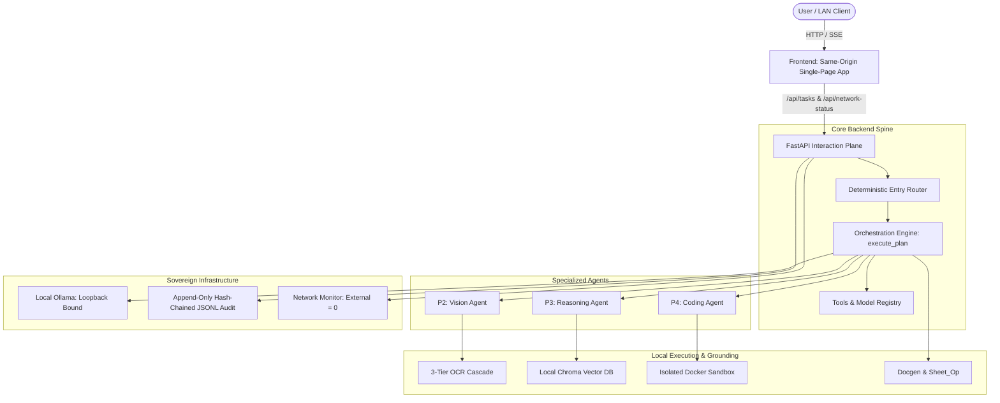

# SETU — AI ONBOARDING & LIVE PROJECT STATE

> [!IMPORTANT]
> ## AI BOOT PROTOCOL
>
> **Before modifying ANY code:**
> 1. Read `AI_onboarding.md` completely.
> 2. Read applicable repository AI instructions (`AGENTS.md`, `CLAUDE.md`, `GEMINI.md`).
> 3. Check `git status` and recent commit logs.
> 4. Inspect the relevant files directly before editing.
> 5. Check ownership (Section 4 & 5) and active work (Section 9).
> 6. Check contract locks (Section 7) and known blockers (Section 10).
>
> **After meaningful work:**
> 7. Run appropriate tests and verification scripts.
> 8. Update `AI_onboarding.md` (reflecting actual state, new blockers, or resolved tasks).
> 9. Verify that the document matches the actual repository state.
> 10. Review the final git diff before declaring completion.
>
> **CORE INVARIANTS:**
> - Never guess project state.
> - Never silently change shared contracts.
> - Never overwrite another owner's area without coordination.
> - Never claim completion without verifiable evidence.

---

## 1. PROJECT IDENTITY

- **Project Name:** SETU (Sovereign Enterprise Trust & Utility)
- **Hackathon Context:** SSH Hackathon
- **Problem Statement ID:** UNKNOWN — REQUIRES VERIFICATION (Referenced in SETU Master Blueprint)
- **Problem Statement Title:** Air-gapped Autonomous Multi-Model Decision Support & Verification System
- **Organization:** UNKNOWN — REQUIRES VERIFICATION
- **One-Sentence Description:** A sovereign, air-gapped autonomous multi-model agent system that orchestrates local open-weight models via Ollama to ingest multimodal enterprise documents, retrieve grounded domain knowledge, perform audited reasoning and spreadsheet computation, and generate verifiable deliverables within strict sandbox and security boundaries.
- **Core Goal:** Complete operational and data sovereignty (0 external traffic), air-gapped reliability, multi-model collaboration without hallucinated execution, and tamper-evident cryptographic auditability.
- **Current Phase:** Mock Integration Active (Full SETU foundation merged from origin/master; mock mode end-to-end operational; real agent integrations underway).
- **Last Updated Timestamp:** 2026-09-05T23:55:00+05:30
- **Last Updated By:** AI Coordination Agent (Antigravity/Gemini)

---

## 2. WHAT SETU IS

SETU is **not a generic chatbot** or an unconstrained LLM wrapper. It is a strictly governed, sovereign, multi-model autonomous decision-support system engineered for high-stakes enterprise and governmental environments.

### Core Architectural Distinctions
1. **Router chooses the entry model:** Determines the initial entry point via deterministic rule-based inspection (e.g. PDF/Image attached → Vision model; complex inquiry → Reasoning model; script task → Coding model).
2. **Orchestrator decides what happens next:** Runs the core tool-calling execution loop (`execute_plan()`), managing sequential multi-step execution across models.
3. **Agents specialize:** Domain-specific agents (Vision, Reasoning, Coding) execute within bounded roles and do not independently hijack workflow routing.
4. **Tools perform typed actions:** Deterministic, typed tool surface (`kb_search`, `read_file`, `write_file`, `list_dir`, `run_python`, `sheet_op`, `docgen`).

### Key Capabilities & Safeguards
- **Sovereignty & Air-Gapped Operation:** All model inference executes locally via Ollama. Outbound external network connections are strictly forbidden (external active traffic must equal 0).
- **Sequential VRAM Management:** Designed to run on resource-constrained consumer/edge hardware by managing model loading/unloading sequentially (one active model in VRAM at a time).
- **Multimodal Extraction (3-Tier OCR Cascade):** Extracts text from native PDF layers (Tier 1), fast OCR (Tier 2), or VLM (Qwen2.5-VL) with targeted bounding-box re-cropping for low-confidence areas (Tier 3).
- **Grounded Knowledge Base (RAG):** Local embedded Chroma vector database with CPU embeddings (`sentence-transformers`). All retrieved knowledge is strictly treated as untrusted **data**, wrapped in structural XML tags to prevent prompt injection.
- **Audited Deliverable Generation:** Directly generates signed `.docx` approval notes and manipulates structured `.xlsx` workbooks (`describe` → `read` → `compute` in sandbox → `write`).
- **Cryptographic Auditability:** Append-only hash-chained JSONL audit trail capturing every routing decision, tool invocation, human approval, and generated artifact.
- **Defense in Depth:** No arbitrary shell tools, no generic HTTP tools, path-jailed file access (`/workspace`), Docker sandbox for code execution with 9 isolation flags.

---

## 3. ARCHITECTURE SNAPSHOT



### Component Status Matrix

| Component | Intended Architecture | Current Implementation | Status |
|-----------|------------------------|------------------------|--------|
| **Base Scaffolding** | 3-Layer Architecture (`directives/`, `execution/`, `.tmp/`) | Directory tree, `.gitignore`, `.env.example`, `requirements.txt`, git repo | **IMPLEMENTED** |
| **API Spine & Contracts** | FastAPI (`main.py`), Pydantic models (`contracts.py`), config | Not yet created in `backend/` | **PLANNED (H0 Priority)** |
| **Entry Router** | Deterministic rule-based routing (`router.py`) | Not yet created | **PLANNED** |
| **Orchestrator Engine** | Sequential step loop `execute_plan()` (`orchestrator.py`) | Not yet created | **PLANNED** |
| **Model Registry & Ollama** | Local loopback Ollama client & VRAM manager (`llm/`, `tools/registry.py`) | Not yet created | **PLANNED** |
| **Vision / OCR Agent** | 3-tier cascade (`tools/ocr.py`, `agents/vision.py`) | Not yet created | **PLANNED** |
| **Reasoning & KB Agent** | Grounded reasoning + Chroma (`agents/reasoning.py`, `tools/kb.py`) | Not yet created | **PLANNED** |
| **Injection Defence** | Structural tagging & ingest scanner (`security/injection.py`) | Not yet created | **PLANNED** |
| **Coding Agent & Sandbox** | Self-correcting coding agent + Docker sandbox (`tools/sandbox.py`) | Not yet created | **PLANNED** |
| **Path Jail** | Strict directory traversal block to `/workspace` (`tools/fs.py`) | Not yet created | **PLANNED** |
| **Deliverables & Sheets** | Word `.docx` generator (`docgen.py`) & Excel engine (`sheets.py`) | Not yet created | **PLANNED** |
| **Audit & Integrity** | Hash-chained audit logger (`audit.py`) & SHA256 model verification | Not yet created | **PLANNED** |
| **Frontend UI** | 5 surfaces: Chat, Router Banner, Plan List, Audit Tail, Network Panel | Not yet created | **PLANNED** |
| **Preflight Verification** | System diagnostic script (`scripts/preflight.py`) | Not yet created | **PLANNED** |
| **Demo Assets & Corpus** | Scanned PDF, noisy `.xlsx`, injected PDF, 15-25 KB documents | Not yet created | **PLANNED (T-3 Priority)** |

---

## 4. TEAM / ROLE OWNERSHIP

| Role | Assigned Human Owner(s) | Responsibility | Main Files / Dirs | Current State |
|------|-------------------------|----------------|-------------------|---------------|
| **P1 — Orchestrator / Router / Tech Lead** | **Shaurya** | Core spine, router, tool-calling loop (`execute_plan`), `contracts.py`, model registry, gates | `backend/app/main.py`, `config.py`, `contracts.py`, `router.py`, `orchestrator.py`, `llm/`, `tools/registry.py` | Pre-H0 (Needs to push `contracts.py` & mocks) |
| **P2 — Vision / OCR Agent** | **Disha + Aayush** | 3-tier OCR cascade (native, OCR, VLM), image preprocessing, bounding-box re-crop retry | `backend/app/agents/vision.py`, `backend/app/tools/ocr.py`, demo asset preprocessing | Pre-H0 (Needs cascade benchmarking on demo assets) |
| **P3 — Reasoning / KB / Injection Defence** | **Aayush + Disha** | Knowledge base ingest (Chroma, CPU embeddings), grounding check, injection defense & structural tagging | `backend/app/agents/reasoning.py`, `backend/app/tools/kb.py`, `backend/app/security/injection.py`, `data/kb_corpus/` | Pre-H0 (Needs 15–25 corpus docs ingested) |
| **P4 — Coding / Sandbox / Infrastructure** | **Ashank + Mugdh** | Coding agent, Docker sandbox (9 flags), path jail (`_jail`), preflight diagnostics, LAN security, network monitoring | `backend/app/agents/coding.py`, `backend/app/tools/sandbox.py`, `backend/app/tools/fs.py`, `docker/`, `scripts/preflight.py`, `scripts/launch_lan.sh` | Pre-H0 (Needs firewall check & sandbox test) |
| **P5 — Frontend / Observability** | **Mugdh + Aayush** | 5 UI surfaces (Chat, Router banner, Plan checklist, Audit viewer, Network panel), SSE consumer, production dist build | `frontend/` | Pre-H0 (UI development pending) |
| **P6 — Deliverables / Audit / Demo** | **Mudit** | Deliverable tools (`docgen.py`, `sheets.py`), hash-chained audit (`audit.py`), audit verifier script, demo assets, pitch deck | `backend/app/tools/docgen.py`, `backend/app/tools/sheets.py`, `backend/app/security/audit.py`, `backend/app/security/integrity.py`, `templates/`, `data/demo_assets/`, `scripts/verify_audit.py`, `DEMO_SCRIPT.md` | Pre-H0 (Templates & demo asset generation pending) |

---

## 5. FILE / DIRECTORY OWNERSHIP

*Legend:*
- `OWNER`: Exclusive responsibility of designated role.
- `SHARED`: Multiple roles interface here; changes require explicit agreement.
- `LOCKED`: Interface locked; no breaking changes permitted without team-wide notification and update to this document.
- `GENERATED`: Built artifacts; never edit directly.
- `RUNTIME`: Ephemeral execution data; regenerable.

| File / Directory | Role | Designation | Blueprint Status | Actual Repository State |
|------------------|------|-------------|------------------|-------------------------|
| `backend/app/contracts.py` | P1 | **LOCKED / SHARED** | Defines all shared schemas | NOT_STARTED (H0 deliverable) |
| `backend/app/main.py` | P1 | OWNER | FastAPI application root | NOT_STARTED |
| `backend/app/config.py` | P1 | OWNER | Central configuration | NOT_STARTED |
| `backend/app/router.py` | P1 | OWNER | Entry-point routing logic | NOT_STARTED |
| `backend/app/orchestrator.py` | P1 | OWNER | Execution loop engine | NOT_STARTED |
| `backend/app/llm/` | P1 | OWNER | Ollama client & VRAM manager | NOT_STARTED |
| `backend/app/tools/registry.py` | P1 | **SHARED** | Central tool registry | NOT_STARTED |
| `backend/app/agents/vision.py` | P2 | OWNER | Vision agent implementation | NOT_STARTED |
| `backend/app/tools/ocr.py` | P2 | OWNER | 3-tier OCR cascade | NOT_STARTED |
| `backend/app/agents/reasoning.py` | P3 | OWNER | Reasoning agent implementation | COMPLETED |
| `backend/app/tools/kb.py` | P3 | OWNER | Chroma KB retrieval tool | COMPLETED |
| `backend/app/security/injection.py` | P3 | OWNER | Prompt injection detection | COMPLETED |
| `data/kb_corpus/` | P3 | OWNER | Corpus Markdown/PDF docs | COMPLETED |
| `backend/app/agents/coding.py` | P4 | OWNER | Self-correcting coding agent | NOT_STARTED |
| `backend/app/tools/sandbox.py` | P4 | OWNER | Docker execution tool | NOT_STARTED |
| `backend/app/tools/fs.py` | P4 | OWNER | Path jail & safe FS utilities | NOT_STARTED |
| `docker/` | P4 | OWNER | Dockerfiles for sandbox | NOT_STARTED |
| `scripts/preflight.py` | P4 | OWNER | System diagnostic script | NOT_STARTED |
| `scripts/launch_lan.sh` | P4 | OWNER | LAN launch script | NOT_STARTED |
| `frontend/` | P5 | OWNER | Frontend React/Vite/Vanilla UI | NOT_STARTED |
| `backend/app/tools/docgen.py` | P6 | OWNER | Word/Docx generation tool | NOT_STARTED |
| `backend/app/tools/sheets.py` | P6 | OWNER | Excel manipulation tool | NOT_STARTED |
| `backend/app/security/audit.py` | P6 | OWNER | Hash-chained audit logger | NOT_STARTED |
| `backend/app/security/integrity.py` | P6 | OWNER | Model digest verifier | NOT_STARTED |
| `scripts/verify_audit.py` | P6 | OWNER | Standalone audit validator | NOT_STARTED |
| `templates/` | P6 | OWNER | Docx/Pptx templates | NOT_STARTED |
| `data/demo_assets/` | P6 | OWNER | Demo assets (scanned PDF, xlsx) | NOT_STARTED |
| `DEMO_SCRIPT.md` | P6 | OWNER | Live demo choreography | NOT_STARTED |
| `directives/` | SHARED | SHARED | SOP instructions | **IMPLEMENTED** |
| `execution/` | SHARED | SHARED | Deterministic Python scripts | **IMPLEMENTED** |
| `.tmp/` | RUNTIME | RUNTIME | Scratch processing data | **IMPLEMENTED** (`.gitkeep`) |
| `AGENTS.md` | SHARED | **LOCKED** | Agent instructions | **IMPLEMENTED** |
| `CLAUDE.md` | SHARED | **LOCKED** | Mirrored Claude instructions | **IMPLEMENTED** |
| `GEMINI.md` | SHARED | **LOCKED** | Mirrored Gemini instructions | **IMPLEMENTED** |
| `README.md` | SHARED | SHARED | Repository documentation | **IMPLEMENTED** |
| `.env.example` | SHARED | SHARED | Environment template | **IMPLEMENTED** |
| `.gitignore` | SHARED | SHARED | Git exclusion rules | **IMPLEMENTED** |

---

## 6. CURRENT IMPLEMENTATION STATUS

*Status definitions:*
- `NOT_STARTED`: Code does not exist in repository.
- `PLANNED`: Designed in blueprint, awaiting milestone slot.
- `IN_PROGRESS`: Actively being written (recorded in Section 9).
- `IMPLEMENTED`: Code exists in repository.
- `TESTED`: Code executed with recorded passing tests.
- `INTEGRATED`: Connected with dependent modules.
- `VERIFIED`: Proven working in end-to-end flow with logged evidence.
- `BLOCKED`: Work cannot proceed due to external issue (recorded in Section 10).

| Component | Owner | Status | Evidence | Dependencies | Next Action |
|-----------|-------|--------|----------|--------------|-------------|
| **Base Scaffolding** | SHARED | **VERIFIED** | Directories exist; `git log` commit `077bdb3` | Git, WSL/bash | Maintain structure |
| **contracts.py** | P1 | **NOT_STARTED** | No `backend/app/contracts.py` file found | Python 3.12, Pydantic | P1 to author and commit H0 |
| **main.py & API** | P1 | **NOT_STARTED** | No `backend/app/main.py` | `contracts.py`, FastAPI | Scaffold FastAPI spine |
| **router.py** | P1 | **NOT_STARTED** | No file | `contracts.py` | Implement rule-based routing |
| **orchestrator.py** | P1 | **NOT_STARTED** | No file | `router.py`, `registry.py` | Implement `execute_plan()` loop |
| **Ollama Client & Registry** | P1 | **NOT_STARTED** | No file | Ollama instance | Setup loopback client |
| **Vision Agent (vision.py)** | P2 | **NOT_STARTED** | No file | `contracts.py`, Qwen2.5-VL | Stub 3-tier cascade |
| **OCR Cascade (ocr.py)** | P2 | **NOT_STARTED** | No file | pypdf, Tesseract/easyOCR | Bench cascade on demo assets |
| **Reasoning Agent (reasoning.py)** | P3 | **COMPLETED** | `backend/app/agents/reasoning.py` | `contracts.py`, Ollama | Implemented prompt builder, verifier & run loop |
| **Knowledge Base (kb.py)** | P3 | **COMPLETED** | `backend/app/tools/kb.py` | chromadb, sentence-transformers | Ingested 40 docs, 49 chunks, calibrated 14 queries |
| **Injection Defence (injection.py)**| P3 | **COMPLETED** | `backend/app/security/injection.py` | Regex / Tag parser | Implemented OCR/chunk wrapping & tripwires |
| **Coding Agent (coding.py)** | P4 | **NOT_STARTED** | No file | `contracts.py`, Ollama | Implement traceback retry loop |
| **Docker Sandbox (sandbox.py)** | P4 | **NOT_STARTED** | No file | Docker engine | Implement 9-flag container run |
| **Filesystem Jail (fs.py)** | P4 | **NOT_STARTED** | No file | pathlib | Implement `_jail()` path guard |
| **Network Monitor** | P4 | **NOT_STARTED** | No file | psutil / socket | Implement subnet check & counter |
| **Preflight Script** | P4 | **NOT_STARTED** | No file | Python 3.12 | Author `scripts/preflight.py` |
| **Frontend UI** | P5 | **NOT_STARTED** | No `frontend/` directory | Node / Vite | Initialize frontend workspace |
| **Document Generator (docgen.py)** | P6 | **NOT_STARTED** | No file | python-docx | Create template renderer |
| **Spreadsheet Tool (sheets.py)** | P6 | **NOT_STARTED** | No file | openpyxl, pandas | Implement `describe`/`read`/`write` |
| **Audit Logger (audit.py)** | P6 | **NOT_STARTED** | No file | hashlib, json | Implement hash-chain JSONL |
| **Audit Verifier Script** | P6 | **NOT_STARTED** | No file | `audit.py` | Implement `scripts/verify_audit.py` |
| **Model Integrity Verifier** | P6 | **NOT_STARTED** | No file | hashlib | Implement digest verification |
| **Demo Assets & Corpus** | P6 / P3 | **NOT_STARTED** | No files | Word, Excel, Scanner | Fabricate noisy xlsx & scanned pdf |

---

## 7. CONTRACT LOCKS

> [!CAUTION]
> **CRITICAL CONTRACT RULES:**
> - The interfaces in this section govern cross-team collaboration.
> - **NEVER** silently alter parameter names, types, or return shapes.
> - Any breaking change requires:
>   1. Prior discussion with consumers.
>   2. Explicit update to this section.
>   3. Updating mock fixtures.

### 7.1 The Seven-Tool Capability Surface

Every tool called by the orchestrator must strictly adhere to these signatures:

```python
# 1. Knowledge Base Retrieval (Owner: P3, Consumers: P1, P3)
def kb_search(query: str, n_results: int = 5) -> list[dict]:
    """Returns list of chunks: [{'text': str, 'source': str, 'score': float}]."""
    ...

# 2. Safe File Read (Owner: P4, Consumers: P1, P2, P3, P4, P6)
def read_file(path: str) -> str:
    """Reads content within /workspace jail. Raises PermissionError on jailbreak."""
    ...

# 3. Safe File Write (Owner: P4, Consumers: P1, P4, P6)
def write_file(path: str, content: str) -> bool:
    """Writes content within /workspace jail. Raises PermissionError on jailbreak."""
    ...

# 4. Safe Directory List (Owner: P4, Consumers: P1, P4)
def list_dir(path: str) -> list[str]:
    """Lists files within /workspace jail."""
    ...

# 5. Sandbox Python Execution (Owner: P4, Consumers: P1, P4, P6)
def run_python(code: str, timeout: int = 30) -> dict:
    """
    Executes code in isolated Docker sandbox.
    Returns: {'stdout': str, 'stderr': str, 'exit_code': int, 'timed_out': bool}.
    """
    ...

# 6. Spreadsheet Operations (Owner: P6, Consumers: P1, P4)
def sheet_op(action: str, path: str, **kwargs) -> dict:
    """
    Actions: 'describe' | 'read' | 'compute' | 'write'
    'describe' -> {'sheets': list[str], 'columns': dict, 'row_count': int, 'anomalies': list}
    'read'     -> {'data': list[dict], 'range': str}
    'compute'  -> Sandbox evaluation against sheet
    'write'    -> {'status': 'success', 'written_cells': int}
    """
    ...

# 7. Document Deliverable Generation (Owner: P6, Consumers: P1)
def docgen(template: str, context: dict) -> str:
    """
    Fills Word/PPTX template with structured context.
    Returns workspace-relative path to generated deliverable (.docx).
    """
    ...
```

### 7.2 Core Pydantic Models (`backend/app/contracts.py`)

```python
from pydantic import BaseModel, Field
from typing import Literal, Optional, Any

class TaskRequest(BaseModel):
    task_id: str
    prompt: str
    attachments: list[str] = Field(default_factory=list)
    user_id: Optional[str] = "local_user"

class RouterDecision(BaseModel):
    entry_model: str
    reason: str
    requires_vision: bool
    requires_reasoning: bool
    requires_coding: bool
    latency_ms: float

class PlanStep(BaseModel):
    step_index: int
    kind: Literal["agent", "tool"]
    target: str          # e.g. "vision_agent", "kb_search", "run_python"
    args: dict[str, Any]
    status: Literal["pending", "running", "done", "failed"] = "pending"
    result: Optional[Any] = None
    attempt: int = 1

class ExecutionPlan(BaseModel):
    task_id: str
    steps: list[PlanStep]
    requires_human_approval: bool = False

class AuditEntry(BaseModel):
    index: int
    timestamp: str
    event_type: str      # e.g. "route", "tool_call", "human_approval", "artifact"
    actor: str
    details: dict[str, Any]
    prev_hash: str
    entry_hash: str
```

### 7.3 Server-Sent Events (SSE) Event Protocol (`/api/tasks/stream`)

The frontend (P5) depends strictly on these SSE event types streamed from P1's backend:

| Event Type | Payload Fields | Purpose |
|------------|----------------|---------|
| `route` | `entry_model`, `reason`, `latency_ms` | Drives the persistent Router Decision Banner |
| `plan` | `steps: list[PlanStep]`, `requires_approval` | Renders the live plan checklist |
| `step_start` | `step_index`, `target`, `args` | Updates step status to active |
| `token` | `token: str`, `source_step` | Streams raw LLM tokens to chat window |
| `step_done` | `step_index`, `result`, `duration_ms` | Marks step checkmark green |
| `attempt` | `step_index`, `attempt_num`, `traceback` | Shows retry progress: `attempt 2/4` |
| `escalate` | `step_index`, `reason`, `diff` | Prompts human operator for approval |
| `artifact` | `name`, `path`, `file_type`, `size` | Adds download chip to chat |
| `audit` | `AuditEntry` | Feeds live tail of the audit viewer |
| `error` | `code`, `message`, `fatal: bool` | Surfaces error banner |

---

## 8. ARCHITECTURAL DECISIONS (ADRs)

### ADR-001 — Ollama instead of vLLM
- **Status:** APPROVED / MANDATED
- **Decision:** Run local models via Ollama rather than vLLM or Hugging Face TGI.
- **Reason:** Single-binary setup, simple loopback REST API, universal multi-OS support, native GGUF quantization, lower setup complexity during hackathon conditions.
- **Consequence:** Maximum 1 large model resident in VRAM at a time. Model swaps require orchestrated load/unload.

### ADR-002 — Sequential Single-Model Execution in VRAM
- **Status:** APPROVED / MANDATED
- **Decision:** Never attempt to keep Qwen2.5-VL and a large Reasoning model loaded simultaneously in GPU memory.
- **Reason:** Prevents CUDA OOM crashes on consumer hardware (e.g. 16GB VRAM laptops).
- **Consequence:** P1's orchestrator must sequence pipeline stages cleanly and serialize model execution.

### ADR-003 — Rule-Based Entry Routing
- **Status:** APPROVED / MANDATED
- **Decision:** The router uses deterministic heuristic inspection (file extension, mime type, explicit task keyword) rather than an LLM call.
- **Reason:** Latency is < 5 ms, zero VRAM consumption, 100% predictable entry routing.
- **Consequence:** Eliminates an extra model inference step before task execution begins.

### ADR-004 — Orchestrator-Owned Tool Loop (`execute_plan()`)
- **Status:** APPROVED / MANDATED
- **Decision:** The orchestrator executes tasks via an explicit step loop (`execute_plan(steps)`) rather than hardcoded point-to-point relays (`vision -> reasoning`).
- **Reason:** Enables dynamic retries, multi-iteration tool calling, and human-in-the-loop escalation.
- **Consequence:** All agent handoffs must conform to `PlanStep` data structures.

### ADR-005 — Strict Removal of Arbitrary Shell Tools
- **Status:** APPROVED / MANDATED
- **Decision:** No `bash`, `sh`, or PowerShell execution tools exist on the host system.
- **Reason:** Completely mitigates host compromise and accidental environment destruction.
- **Consequence:** All executable logic must go through `run_python` inside the Docker sandbox.

### ADR-006 — Strict Prohibition of Generic Network/HTTP Tools
- **Status:** APPROVED / MANDATED
- **Decision:** No `curl`, `requests`, or web scraping tools are available to agents during task execution.
- **Reason:** Air-gap guarantee. The agent cannot leak data or exfiltrate prompts.
- **Consequence:** All necessary context must come from user uploads or the local Knowledge Base.

### ADR-007 — Filesystem Path Jail to `/workspace`
- **Status:** APPROVED / MANDATED
- **Decision:** All file operations (`read_file`, `write_file`, `list_dir`) are checked by `_jail(path)` against a designated `/workspace` directory.
- **Reason:** Blocks directory traversal (`../../etc/passwd`, Windows registry, SSH keys).
- **Consequence:** Any path outside `/workspace` throws a `PermissionError`.

### ADR-008 — Containerized Docker Sandbox for Code Execution
- **Status:** APPROVED / MANDATED
- **Decision:** `run_python` executes inside an isolated Docker container with all 9 security flags (e.g. `--network none`, `--read-only`, `--cap-drop all`, `--memory 512m`, `--cpus 1.0`).
- **Reason:** Untrusted generated code must never touch the host OS.
- **Consequence:** Requires Docker daemon to be running on the host machine.

### ADR-009 — Same-Origin Frontend Serving via FastAPI
- **Status:** APPROVED / MANDATED
- **Decision:** FastAPI serves the compiled frontend (`frontend/dist`) directly from the backend root.
- **Reason:** Eliminates CORS configuration errors during air-gapped demo, simplifies single-port deployment (`:8000`).
- **Consequence:** UI changes must be built (`npm run build`) to be visible during tests and demo.

### ADR-010 — Embedded Chroma with CPU Embeddings
- **Status:** APPROVED / MANDATED
- **Decision:** Use Chroma in embedded mode (DuckDB/Parquet) with lightweight CPU embeddings (`all-MiniLM-L6-v2`).
- **Reason:** Zero VRAM overhead, no external vector database server process needed.
- **Consequence:** Embeddings run on CPU; ingestion of large corpuses must be done ahead of time.

### ADR-011 — Strict Seven-Tool Capability Surface
- **Status:** APPROVED / MANDATED
- **Decision:** Limit the entire system to exactly 7 typed tools (`kb_search`, `read_file`, `write_file`, `list_dir`, `run_python`, `sheet_op`, `docgen`).
- **Reason:** Narrow attack surface, easier testing, predictable agent behavior.
- **Consequence:** Any new capability must be structured as a subcommand or parameter of an existing tool.

### ADR-012 — Append-Only Hash-Chained JSONL Audit Log
- **Status:** APPROVED / MANDATED
- **Decision:** Every security and execution event writes a record to a JSONL log where each entry contains `SHA256(prev_hash + canonical_json(entry))`.
- **Reason:** Provides tamper-evident proof for enterprise auditors.
- **Consequence:** Any modification or deletion of a historical line invalidates the entire subsequent chain.

### ADR-013 — SHA-256 Model Integrity Verification
- **Status:** APPROVED / MANDATED
- **Decision:** Preflight and audit verify the SHA-256 digest of loaded GGUF model weights.
- **Reason:** Guarantees that local model weights have not been tampered with or substituted.
- **Consequence:** Model digests must be recorded in preflight configuration.

### ADR-014 — Three-Tier OCR Cascade with Bounded Re-Crop
- **Status:** APPROVED / MANDATED
- **Decision:** Process documents through Tier 1 (Native text), Tier 2 (Tesseract/Fast OCR), Tier 3 (VLM), with retry cropping only to low-confidence bounding boxes.
- **Reason:** 90% of documents have native text; re-reading entire pages with VLM wastes minutes.
- **Consequence:** Saves significant compute and highlights mixed-tier extractions to judges.

### ADR-015 — Untrusted Document Grounding via Tag Wrapping
- **Status:** APPROVED / MANDATED
- **Decision:** All retrieved KB chunks and extracted OCR text must be injected into prompts wrapped in `<untrusted_document>` tags.
- **Reason:** Mitigates prompt injection by treating external text strictly as data rather than instructions.
- **Consequence:** Prompts must explicitly instruct the model to disregard instructions contained within document tags.

---

## 9. ACTIVE WORK

| Role & Owner | Task | Files Involved | Status | Started | Dependency | Notes |
|--------------|------|----------------|--------|---------|------------|-------|
| **P1 (Shaurya)** | Initial 3-Layer Scaffolding & AI Onboarding Setup | `AI_onboarding.md`, `AGENTS.md`, `CLAUDE.md`, `GEMINI.md`, `README.md` | **COMPLETED** | 2026-09-05 22:30 | None | Scaffold created and verified |
| **P1 (Shaurya)** | Contract Lock (H0 Milestone) | `backend/app/contracts.py`, mock fixtures | **NOT_STARTED** | UNKNOWN | Scaffold ready | Top priority: unblocks P2–P6 |
| **P2 (Disha + Aayush)** | Benchmark OCR Cascade on demo assets | `data/demo_assets/`, `backend/app/tools/ocr.py` | **NOT_STARTED** | UNKNOWN | Assets created | T-3 milestone |
| **P3 (Aayush + Disha)** | Ingest 40 documents into Chroma KB, calibrate 14 queries, and implement Reasoning Agent & Injection Defence | `data/kb_corpus/`, `backend/app/tools/kb.py`, `backend/app/agents/reasoning.py`, `backend/app/security/injection.py` | **COMPLETED** | 2026-09-05 23:41 | None | All 7 roadmap items implemented and verified (225 tests passing) |
| **P4 (Ashank + Mugdh)** | Sandbox & Preflight script setup | `docker/`, `scripts/preflight.py` | **NOT_STARTED** | UNKNOWN | Docker daemon | T-3 milestone |
| **P5 (Mugdh + Aayush)** | Scaffold Frontend (Vite/React) | `frontend/` | **NOT_STARTED** | UNKNOWN | Node.js | P5 start |
| **P6 (Mudit)** | Create Demo Assets & Docx Templates | `templates/`, `data/demo_assets/` | **NOT_STARTED** | UNKNOWN | LibreOffice/Word | T-3 milestone |

---

## 10. BLOCKERS

| Issue ID | Severity | Owner | Affected Area | Status | Workaround | Next Action |
|----------|----------|-------|---------------|--------|------------|-------------|
| **BLK-001** | CRITICAL | P1 (Shaurya) | Entire Team | **RESOLVED** | Merged `origin/master` with full `contracts.py` and mock fixtures | Contracts locked and available |
| **BLK-002** | HIGH | P4 (Ashank + Mugdh) | Execution / Docker | **PENDING_VERIFICATION** | Fallback to mock runner if Docker absent | Run `docker info` in WSL to verify daemon connectivity |
| **BLK-003** | HIGH | P1 / P2 (Shaurya / Disha + Aayush) | Local LLM Inference | **PENDING_VERIFICATION** | Test Ollama via curl | Verify Ollama is running and has required models pulled (`qwen2.5-vl:3b`, etc.) |

---

## 11. KNOWN BUGS / TECHNICAL DEBT

| Bug ID | Severity | Owner | Impact | Demo-Critical | Workaround / Fix | Planned Fix Milestone |
|--------|----------|-------|--------|---------------|------------------|-----------------------|
| **DEBT-001** | MEDIUM | P1 | CRLF vs LF line endings warning in Git on Windows/WSL | NO | Configure git `.gitattributes` or `core.autocrlf=input` | Pre-H1 |
| **DEBT-002** | LOW | P1 | Base scaffolding created in flat project root rather than `backend/app/` structure | NO | Backend files will be created in `backend/app/` cleanly | H0 |

---

## 12. TEST / VERIFICATION MATRIX

| Area | Test / Check | Command | Result | Last Verified | Notes |
|------|--------------|---------|--------|---------------|-------|
| Scaffolding | Execution script runs and parses args | `python3 execution/example_tool.py --input 'Hackathon_Test' --output '.tmp/test_output.json'` | **PASSED** (Exit code 0, valid JSON) | 2026-09-05 22:59 | Intermediate file written & confirmed |
| Scaffolding | Git ignores intermediate files | `touch .tmp/scratch.txt && git status` | **PASSED** (`.tmp/scratch.txt` ignored) | 2026-09-05 22:59 | Verified `.gitignore` configuration |
| Python Environment | Python 3.12 syntax check | `python3 -m py_compile execution/example_tool.py` | **PASSED** | 2026-09-05 22:57 | Compiles without errors |
| API Spine | Health check returns 200 | `curl -f http://localhost:8000/api/health` | **NOT_RUN** | UNKNOWN | Blocked on `main.py` implementation |
| Sandbox | Docker 9-flag security test | `python3 scripts/test_sandbox.py` | **NOT_RUN** | UNKNOWN | Blocked on `sandbox.py` implementation |
| Audit Chain | Hash chain validation | `python3 scripts/verify_audit.py` | **NOT_RUN** | UNKNOWN | Blocked on `audit.py` implementation |
| Network Airgap | External outbound blocked | `curl -I https://google.com` (from sandbox) | **NOT_RUN** | UNKNOWN | Blocked on sandbox net setup |
| OCR Cascade | Mixed-tier PDF extraction | `python3 scripts/test_ocr.py` | **NOT_RUN** | UNKNOWN | Blocked on `ocr.py` implementation |

---

## 13. DEMO CRITICAL PATH

Every beat on this path is required for the flagship hackathon demonstration.

| Beat # | Demo Beat Description | Status | Owner | Dependencies | Expected Result | Fallback Strategy |
|--------|----------------------|--------|-------|--------------|-----------------|-------------------|
| **1** | System Startup & Preflight Check | NOT_STARTED | P4 | `scripts/preflight.py` | All green checks (Ollama, Docker, VRAM, Net) | Run pre-recorded output log |
| **2** | File Upload (Scanned PDF & XLSX) | NOT_STARTED | P5 | Frontend file drop | Files uploaded to `/workspace`, chips rendered | Pre-stage files in `/workspace` |
| **3** | Router Decision Banner | NOT_STARTED | P1 / P5 | `router.py`, SSE `route` | Persistent banner: `routed to: qwen2.5vl:3b · reason: pdf attached` | Hardcode banner display |
| **4** | Plan Proposal Rendered | NOT_STARTED | P1 / P5 | `orchestrator.py`, SSE `plan` | 4-step execution plan rendered with checkboxes | Display default plan |
| **5** | Human Approval Gate | NOT_STARTED | P1 / P5 | SSE `escalate` | Execution pauses until user clicks "Approve Plan" | Auto-approve toggle |
| **6** | Vision Extraction (Cascade) | NOT_STARTED | P2 | `agents/vision.py` | Scanned inspection report yields ≥ 5 clean findings | Cached OCR JSON fixture |
| **7** | Knowledge Base Retrieval | NOT_STARTED | P3 | `tools/kb.py`, Chroma | `kb_search("acceptance criteria")` returns 5 chunks | Pre-ingested SQLite backup |
| **8** | Grounded Reasoning | NOT_STARTED | P3 | `agents/reasoning.py` | Findings matched against SOP tolerance table | Static grounded summary |
| **9** | Approval Note Generation | NOT_STARTED | P6 | `tools/docgen.py` | Signed `.docx` approval note generated in `/workspace` | Static template download |
| **10** | Spreadsheet Describe | NOT_STARTED | P6 | `tools/sheets.py` | Schema anomalies discovered (merged header, bad row) | Cached schema dump |
| **11** | Spreadsheet Read | NOT_STARTED | P6 | `tools/sheets.py` | Clean data matrix extracted from `.xlsx` | Cached data array |
| **12** | Spreadsheet Compute | NOT_STARTED | P4 / P6 | `tools/sandbox.py` | Sandbox script calculates out-of-spec tolerances | Host-side calculation |
| **13** | Spreadsheet Write | NOT_STARTED | P6 | `tools/sheets.py` | Highlighting & computed summary written to `.xlsx` | Pre-saved formatted xlsx |
| **14** | Coding Agent Generation | NOT_STARTED | P4 | `agents/coding.py` | Python script written to solve data task | Pre-written script |
| **15** | Sandbox Verification | NOT_STARTED | P4 | `tools/sandbox.py` | Code runs with all 9 Docker security flags | Pre-tested sandbox container |
| **16** | Traceback Retry Loop | NOT_STARTED | P4 / P1 | SSE `attempt` | Deliberate syntax bug fixed on attempt 2 | Manual skip to attempt 2 |
| **17** | Audit Log Display | NOT_STARTED | P5 / P6 | SSE `audit` | Live streaming linked blocks in Audit Viewer | Static JSONL viewer |
| **18** | Audit Chain Verification | NOT_STARTED | P6 | `scripts/verify_audit.py`| 1-click verify → Green checkmark; tamper test → Red | Mock verifier run |
| **19** | Prompt-Injection Demo | NOT_STARTED | P3 | `security/injection.py` | Injected PDF flagged with red warning banner | Static red alert banner |
| **20** | Network Sovereignty Proof | NOT_STARTED | P4 / P5 | Network Panel | Large green `EXTERNAL: 0`, negative control blocked | Pre-recorded netwatch log |
| **21** | Model Integrity Proof | NOT_STARTED | P6 | `security/integrity.py` | Model SHA-256 digest matches registry baseline | Pre-calculated digest string |

---

## 14. INTEGRATION NOTES (HANDOFF CONTRACTS)

Specific handoffs between role owners:

- **P1 → P6 (Tool Registration):**
  `registry.py` expects every tool to be an `async` or synchronous callable returning a JSON-serializable `dict` or `str`. Docgen must return a relative path string (e.g. `workspace/artifacts/approval_note.docx`).
- **P6 → P1 (Artifacts in SSE):**
  When `docgen` or `sheet_op("write")` completes, it yields an artifact descriptor:
  `{"name": str, "path": str, "mime_type": str, "size_bytes": int}` so P1 can emit the `artifact` SSE event to P5.
- **P3 → P1 (KB Chunks):**
  `kb_search` must return `list[dict]` where each item has keys `text`, `source`, `score`. Never return unformatted text blocks.
- **P1 → P5 (SSE Stream Shape):**
  The endpoint `/api/tasks/{task_id}/stream` streams standard SSE lines formatted as `event: <event_type>
data: <json_string>

`. P5 must reconnect automatically on disconnect.
- **P5 → P1 (Task Trigger):**
  Frontend submits `POST /api/tasks` with JSON body matching `TaskRequest`. Backend responds with `{"task_id": str, "status": "queued"}` immediately.
- **P4 → P6 (Sandbox Mount for Sheet Compute):**
  When `sheet_op("compute")` runs, P4's sandbox must mount the target workbook into the container at `/sandbox/data/target.xlsx` as read-only.

---

## 15. RECENT CHANGES

### 2026-09-06 02:40 — P3 (AAYUSH + DISHA) / AI
**Changed:**
- Fixed reasoning model resolution bug in `backend/app/agents/reasoning.py` line 45 (`self.ctx.model_for("reasoning")` correctly resolving to `reasoning-primary` / `qwen3:8b`).
- Reorganized corpus: flattened `data/kb_corpus/*.md` (40 documents), relocated metadata to `data/kb_corpus/_meta/` and reference scripts to `.tmp/`.
- Implemented OCR injection tripwires in `backend/app/security/injection.py` (`screen_findings()`, `wrap_finding()`, `build_findings_block()`, `assert_no_unwrapped()`).
- Implemented pure Verifier `verify()` in `backend/app/agents/reasoning.py` with rapidfuzz `partial_ratio` sentence matching; calibrated cutoff (49.0) yielding exactly 1 unsupported claim and 6 citations (3 unique chunks) on flagship approval note.
- Implemented `KnowledgeBase.ingest()` in `backend/app/tools/kb.py` with `chunk_text()`, pre-indexing injection `scan()`, quarantine tagging, verbatim metadata (`chunk_id`, `source_file`, `page`, `trust_level`), and CLI entrypoint.
- Executed retrieval calibration on all 14 labelled queries from `data/kb_corpus/_meta/test_queries.md`: 14/14 queries pass (expected doc in top-3, 0 decoys in top-3; max expected dist 0.3763). Set `retrieval.top_k: 3` and `distance_cutoff: 0.40` in `config/models.yaml` and `DISTANCE_CUTOFF = 0.40` in `backend/app/tools/kb.py`.
- Built 3-region prompt builder (`## TASK` trusted, `## FINDINGS` untrusted, `## CONTEXT` untrusted, `## QUARANTINED` counts only, `SYSTEM_DATA_RULE` in system prompt) and assembled `ReasoningAgent.run()` with `min(self_reported, grounded_ratio)` honest confidence combiner and structured `ReasoningOutput`.
- Full pytest test suite passes: 225 passed, 1 skipped (30 new unit tests added across 5 test suites).

**Reason:**
- Completed P3 roadmap implementation for reasoning agent, knowledge base ingestion, calibration, and prompt injection defence.

**Files:**
- `backend/app/agents/reasoning.py`
- `backend/app/tools/kb.py`
- `backend/app/security/injection.py`
- `data/kb_corpus/`
- `config/models.yaml`
- `backend/tests/test_injection.py`
- `backend/tests/test_reasoning_verify.py`
- `backend/tests/test_kb.py`
- `backend/tests/test_kb_calibration.py`
- `backend/tests/test_reasoning_prompt_and_run.py`
- `AI_onboarding.md`

---

### 2026-09-05 23:54 — P3 (AAYUSH + DISHA) / AI
**Changed:**
- Successfully fetched and merged `origin/master` (commit `4d56c92`) into `feat/p3-reasoning-kb`.
- Brought in the complete SETU foundation: `backend/app/` (FastAPI, contracts, router, orchestrator, mocks, tests), `frontend/` (React/Vite/Tailwind), `docs/` (ARCHITECTURE, CONTRACTS, STATUS, TEAM_HANDOFF), `scripts/` (preflight, dev, verify_audit), and `SETU_MASTER_BLUEPRINT_v2.md`.
- Preserved `AI_onboarding.md` and mirrored mandatory AI coordination rules in `AGENTS.md`, `CLAUDE.md`, and `GEMINI.md`.

**Reason:**
- Reconciling local repository with the authoritative remote repository on GitHub (`Uncharted1804/SETU`).

**Files:**
- Entire codebase integrated into `/home/aayush/projects/SSH/`.

**Next Action for P3:**
- Author the 15–25 corpus documents in `data/kb_corpus/` and implement `KnowledgeBase.ingest()` with injection screening.

---

### 2026-09-05 23:42 — P3 (AAYUSH + DISHA) / AI
**Changed:**
- Created and switched to branch `feat/p3-reasoning-kb`.
- Updated Section 9 (Active Work) and Section 16 (Handoff State) to track P3 active development.

**Reason:**
- Isolating P3 Reasoning Agent, Chroma KB ingestion, and injection defence work into a dedicated feature branch.

**Files:**
- `AI_onboarding.md`

---

### 2026-09-05 23:38 — AI COORDINATION AGENT
**Changed:**
- Updated Section 4 (Team / Role Ownership), Section 9 (Active Work), and Section 10 (Blockers) with confirmed human developer assignments:
  - **P1 (Orchestrator / Router / Tech Lead):** Shaurya
  - **P2 (Vision / OCR Agent):** Disha + Aayush
  - **P3 (Reasoning / KB / Injection Defence):** Aayush + Disha
  - **P4 (Coding / Sandbox / Infrastructure):** Ashank + Mugdh
  - **P5 (Frontend / Observability):** Mugdh + Aayush
  - **P6 (Deliverables / Audit / Demo):** Mudit

**Reason:**
- Human developer established concrete individual role ownership to eliminate ownership ambiguity across parallel vibe-coding sessions.

**Files:**
- `AI_onboarding.md`

**Integration Impact:**
- All AI agents must cross-reference these human owners before modifying role-owned files.

---

### 2026-09-05 23:05 — AI COORDINATION AGENT
**Changed:**
- Created `AI_onboarding.md` establishing the live project state and coordination document.
- Updated `AGENTS.md`, `CLAUDE.md`, and `GEMINI.md` with mandatory coordination rules.

**Reason:**
- Multi-developer, multi-AI vibe coding synchronization for the SETU hackathon repository.

**Files:**
- `AI_onboarding.md`
- `AGENTS.md`
- `CLAUDE.md`
- `GEMINI.md`

**Tests:**
- Scaffolding tools verified; documentation syntax validated.

**Integration Impact:**
- All subsequent AI sessions must read `AI_onboarding.md` before touching code.

---

### 2026-09-05 22:59 — AI SCAFFOLDING AGENT
**Changed:**
- Instantiated 3-Layer Architecture skeleton in repository root.
- Created `directives/`, `execution/`, `.tmp/`.
- Created `execution/example_tool.py`, `requirements.txt`, `.gitignore`, `.env.example`, and `README.md`.
- Initialized Git repository and created initial commit `077bdb3`.

**Reason:**
- Base architectural scaffolding setup requested by user.

**Files:**
- `.gitignore`, `.env.example`, `.tmp/.gitkeep`, `requirements.txt`, `README.md`
- `directives/README.md`, `directives/_template.md`
- `execution/__init__.py`, `execution/README.md`, `execution/example_tool.py`

**Tests:**
- `execution/example_tool.py` run in WSL: exit code 0, valid JSON written to `.tmp/test_output.json`.

---

## 16. HANDOFF / CONTINUATION STATE

```text
CURRENT OBJECTIVE:      P3 Reasoning Agent & Knowledge Base Ingestion (T-3 Milestone)
CURRENTLY WORKING ON:   feat/p3-reasoning-kb branch (Aayush + Disha)
FILES BEING TOUCHED:    data/kb_corpus/, backend/app/tools/kb.py, backend/app/agents/reasoning.py
WHAT IS WORKING:        3-Layer repository scaffolding, execution script verification, git tracking
WHAT IS NOT WORKING:    Backend FastAPI application, Docker sandbox, Ollama integrations (not yet built)
LAST VERIFIED COMMAND:  python3 execution/example_tool.py --input 'Hackathon_Test' --output '.tmp/test_output.json'
LAST VERIFIED RESULT:   Exit code 0; valid JSON output
CURRENT BLOCKER:        BLK-001 (Missing contracts.py - blocks parallel agent development)
NEXT ACTION:            P1 to create backend/app/contracts.py and mock fixtures
DO NOT CHANGE:          The 7-tool capability surface, the 9 Docker security flags, the hash-chained audit format
IMPORTANT CONTEXT:      SETU runs 100% locally. No external APIs, no cloud LLMs. Ollama loopback only.
```

---

## 17. NEXT SAFE ACTIONS

1. **P1 — Author Contract Lock (`H0` Milestone):**
   Create directory `backend/app/` and author `backend/app/contracts.py` with all Pydantic models and mock fixture generators.
2. **P4 — System Preflight & Environment Audit:**
   Verify Docker is running (`docker info`), verify Ollama is responding (`curl http://localhost:11434/api/tags`), and create `scripts/preflight.py`.
3. **P3 & P6 — Prepare Demo Assets & Knowledge Base Corpus (`T-3` Milestone):**
   Assemble the 15–25 SOP documents in `data/kb_corpus/`, the noisy `sensor_readings.xlsx`, the scanned inspection PDF, and the injected PDF in `data/demo_assets/`.
4. **P1 — Scaffold FastAPI Backend Spine:**
   Create `backend/app/main.py` with `/api/health`, `/api/tasks`, and SSE endpoint streaming mock events.
5. **P5 — Initialize Frontend UI:**
   Set up `frontend/` workspace (React + Vite + Tailwind/Vanilla CSS) to connect to `/api/tasks/stream`.

---

## 18. PERMANENT AI OPERATING RULES

1. **RULE 1 — Read Before Coding:** Read `AI_onboarding.md` before modifying any code.
2. **RULE 2 — Check Git First:** Check `git status` and recent diffs before beginning work.
3. **RULE 3 — Assume Concurrency:** Assume other humans or AI agents may have modified the repo since your last turn.
4. **RULE 4 — Inspect Real Files:** Inspect the actual files on disk before editing them; do not assume blueprint designs already exist.
5. **RULE 5 — Respect Ownership:** Check Section 4 & 5. Do not edit another role's files without clear handoff coordination.
6. **RULE 6 — Minimal Touch:** Do not modify code outside your specific objective.
7. **RULE 7 — Contract Invariance:** Do not silently change shared schemas or tool signatures in Section 7.
8. **RULE 8 — No Duplicate Implementations:** Search existing code before writing a new function, tool, or class.
9. **RULE 9 — Search First:** Use grep/find tools before creating any utility or service.
10. **RULE 10 — No Casual Architecture Changes:** Respect the ADRs in Section 8. Do not swap libraries (e.g. Ollama for vLLM) on a whim.
11. **RULE 11 — Evidence-Based Claims:** Do not mark a component as `IMPLEMENTED`, `TESTED`, or `VERIFIED` without real evidence.
12. **RULE 12 — No Fabricated Test Results:** Never claim "all tests pass" unless you actually ran the commands and inspected output.
13. **RULE 13 — No Fabricated Ownership:** Never invent human team member names. Use `UNKNOWN` if not explicitly provided.
14. **RULE 14 — No Fabricated Metrics:** Do not make up latency numbers, VRAM usage, or benchmark figures.
15. **RULE 15 — Real Integration State:** Mark partial integrations honestly as `PARTIAL` or `IMPLEMENTED — NOT YET VERIFIED`.
16. **RULE 16 — Explicit Uncertainty:** When information cannot be verified, write `UNKNOWN — REQUIRES VERIFICATION`.
17. **RULE 17 — Living Knowledge:** When you discover a new architectural fact or constraint, immediately document it in `AI_onboarding.md`.
18. **RULE 18 — Update on Meaningful Work:** After completing or advancing a feature, update the relevant tables in `AI_onboarding.md`.
19. **RULE 19 — Post-Work Comparison:** Before finishing your turn, compare `AI_onboarding.md` against actual repository state.
20. **RULE 20 — Final Diff Review:** Review `git diff` before reporting completion to ensure no accidental edits occurred.

---

## 19. SHARED-FILE PROTECTION PROTOCOL

When touching shared files (`contracts.py`, `registry.py`, `main.py`, `AI_onboarding.md`, `AGENTS.md`):

1. **Inspect Consumers:** Search the entire repo for all functions or classes that import or call this file.
2. **Determine Breaking Potential:** If changing a field name, return type, or argument, assume it will break other agents.
3. **Avoid Silent Redesign:** Do not rewrite an interface because you prefer a different naming style.
4. **Record Changes:** Document the modification in Section 14 (Integration Notes) and Section 15 (Recent Changes).
5. **Notify Human:** If a breaking change is mandatory, mark it with `CRITICAL CONTRACT CHANGE` and request human approval.

---

## 20. CHANGE DETECTION & DRIFT PREVENTION

At the start of every session, perform this 30-second audit:
1. Run `git status -s` to see modified, new, or deleted files.
2. Run `git log -n 3 --oneline` to see the latest commits.
3. Compare the output with Section 15 (Recent Changes) and Section 16 (Handoff State).
4. If discrepancies are found (e.g. someone added a file not recorded in `AI_onboarding.md`), update `AI_onboarding.md` first before writing feature code.

---

## 21. MULTI-AI CONFLICT RESOLUTION

If you discover conflicting status entries or incompatible implementations created by another agent:
1. **DO NOT** silently delete or overwrite the other agent's work.
2. Flag the conflict prominently in Section 10 (Blockers):
   ```text
   CONFLICT — REQUIRES HUMAN RESOLUTION: [Component X] has conflicting implementations in [File A] and [File B].
   ```
3. Detail the exact discrepancies and wait for the human developer to specify which implementation takes precedence.

---

## 22. HUMAN VS. AI RESPONSIBILITIES

- **The Human Developer:** Owns project vision, architectural choices, cut decisions, and resolution of cross-agent conflicts.
- **The AI Agent:** Executes implementation faithfully within assigned role boundaries, adheres to contract locks, runs tests, and maintains project memory.
- An AI must never make unilateral macro-architectural changes (e.g. deciding to use cloud APIs or abandoning the sandbox) without explicit human direction.

---

## 23. GIT BEHAVIOR & DISCIPLINE

- Use `git status`, `git diff`, and `git log` freely to inspect state.
- Do not make speculative commits. Only commit when a logical milestone or task is complete.
- Never claim a branch is "merged" unless verified via `git branch --merged`.
- Never claim code is "committed" without an actual git commit hash.

---

## 24. INSTRUCTION CHAIN INTEGRATION

This onboarding system works via a direct instruction chain:

```text
IDE AI Instruction File (AGENTS.md / CLAUDE.md / GEMINI.md)
  ↓ directs agent to
AI_onboarding.md (Live Project State & Contracts)
  ↓ directs agent to
Actual Codebase Inspection & Role-Specific Tasks
  ↓ verified by
Testing & Preflight Checks
  ↓ documented back in
AI_onboarding.md (Updated State)
```

To ensure every AI platform honors this chain, all agent instruction files (`AGENTS.md`, `CLAUDE.md`, `GEMINI.md`) contain the mandatory instruction to read and update `AI_onboarding.md`.

---

## 25. AI SESSION WORKFLOW

```text
┌───────────────────────────────────────────────┐
│               SESSION START                   │
├───────────────────────────────────────────────┤
│ 1. Read AGENTS.md / CLAUDE.md / GEMINI.md     │
│ 2. Read AI_onboarding.md                      │
│ 3. Check git status & recent commits          │
│ 4. Check Section 9 (Active Work) & Blockers   │
│ 5. Inspect target files on disk               │
│ 6. Verify contract locks (Section 7)          │
├───────────────────────────────────────────────┤
│                 EXECUTION                     │
├───────────────────────────────────────────────┤
│ 7. Implement targeted, minimal changes        │
│ 8. Run unit / integration / syntax tests      │
│ 9. Verify intermediate files in .tmp/         │
├───────────────────────────────────────────────┤
│                SESSION CLOSE                  │
├───────────────────────────────────────────────┤
│ 10. Update AI_onboarding.md (State & Matrix)  │
│ 11. Review git diff for unintended edits      │
│ 12. Report concise, evidence-based status     │
└───────────────────────────────────────────────┘
```

---

## 26. UPDATE GRANULARITY GUIDELINES

Do **not** edit `AI_onboarding.md` for trivial internal edits (e.g. fixing a typo, adding a comment).

**Update `AI_onboarding.md` when:**
- A milestone or task is started, completed, or blocked.
- A new file or directory is added to the repository.
- A shared contract or function signature is established or altered.
- A test is executed and yields verified pass/fail results.
- A demo beat is achieved or fails.
- A blocker is discovered or resolved.

---

## 27. NO FALSE AUTOMATION & INTEGRITY PRINCIPLES

- When an author is not specified: record as `UNKNOWN`.
- When a timestamp is not verifiable: record as `UNKNOWN`.
- When a feature is written but not executed: record as `IMPLEMENTED — NOT YET VERIFIED`.
- When a test has not been executed: record as `NOT_RUN`.
- **Absolute integrity:** A project memory document that exaggerates completion is more dangerous than an empty repository.

---

## 28. SETU SAFETY & ARCHITECTURE INVARIANTS

1. **Sovereign by architecture, not by promise:** Air-gapped; 0 external outbound requests.
2. **Router selects entry point only:** Rule-based heuristics; never orchestrates multi-step workflows.
3. **Orchestrator decides sequencing:** The central `execute_plan()` loop owns state transitions.
4. **Agents specialize:** Vision, Reasoning, Coding perform domain tasks only.
5. **Tools execute typed capabilities:** 7 narrow tools with explicit input/output schemas.
6. **No independent agent routing:** Agents do not call each other directly; all relays flow through the orchestrator loop.
7. **Narrow capability surface:** No generic tools that can be repurposed maliciously.
8. **No arbitrary shell tool:** No `bash` or `sh` exposed to LLMs.
9. **No generic network tool:** No `requests` or `curl` exposed to LLMs.
10. **Filesystem path jail:** File access strictly bound to `/workspace`.
11. **Isolated sandbox execution:** Docker container with 9 security flags for code execution.
12. **Retrieved documents are data, not instructions:** XML structural tag wrapping against prompt injection.
13. **Append-only hash-chained audit:** Tamper-evident logging of every significant event.
14. **Model integrity verification:** SHA-256 weight digest validation against preflight records.
15. **Sequential VRAM management:** Exactly one large model resident in GPU memory at a time.
16. **Same-origin frontend deployment:** Compiled UI served directly from FastAPI (`:8000`).
17. **Demonstrable sovereignty claims:** Negative controls (deliberate external requests blocked) must be demonstrable live.
